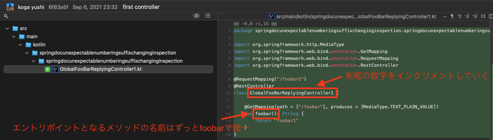
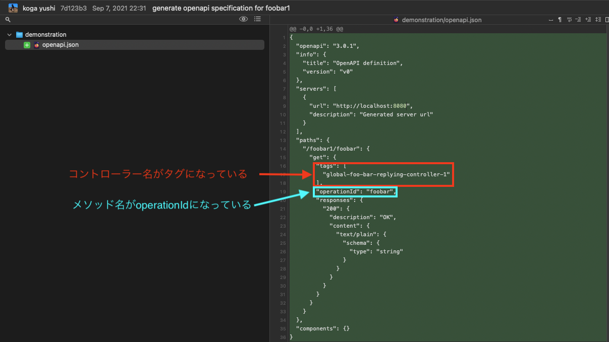
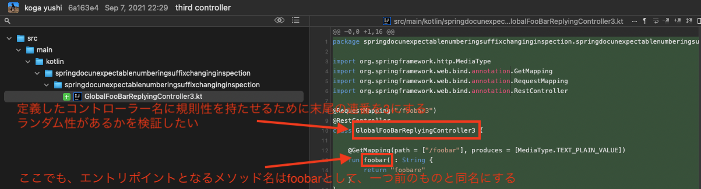
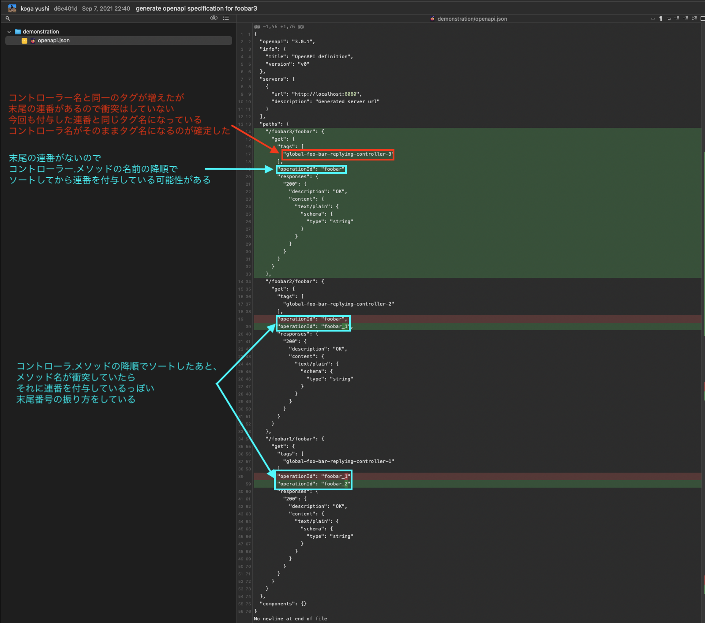
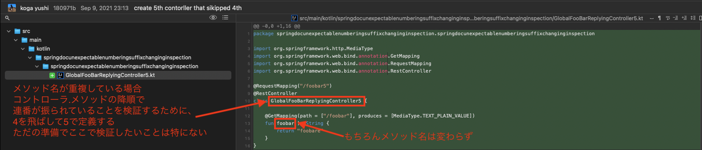
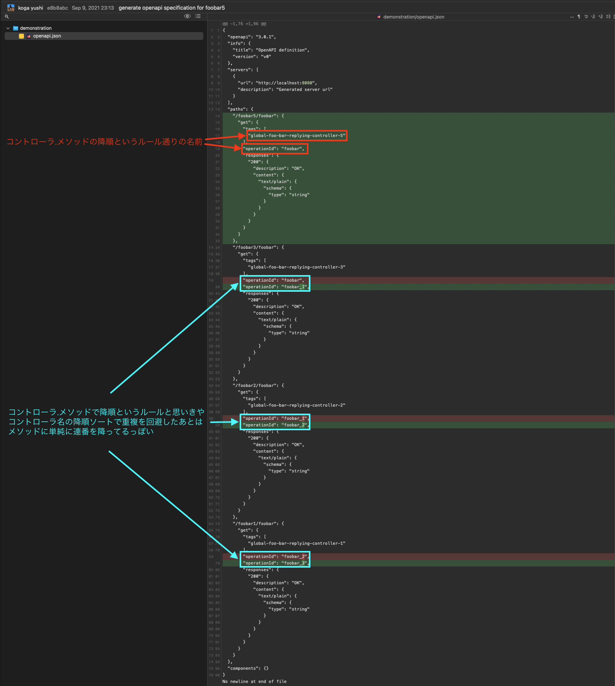
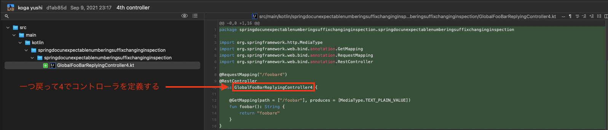
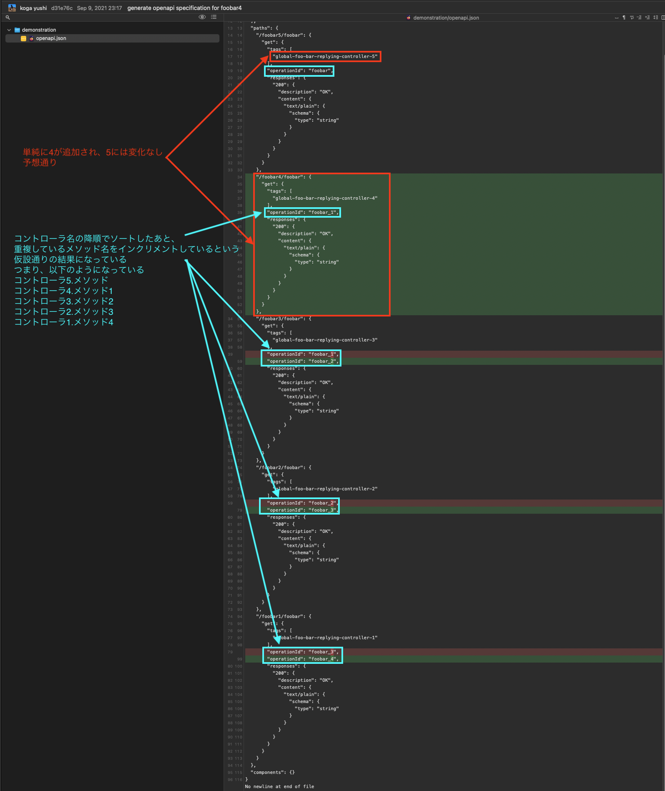

## このアプリは何を検証するもの？

コントローラーのメソッド名に対してグローバルに一意でない名前を定義したときspringdoc openapiで生成される仕様ファイルで静止されるoperationIdのルールを調べるものです

## はじめに検証の結論

コントローラ名の降順でソートしたあと、メソッド名が重複していた場合、最初は連番なし、次にシンプルにインクリメントしていく連番を付与しています

## 検証した内容のキャプチャ
キャプチャに解説を載せたものを並べますのでキャプチャを上から順番に見ていってください
なお、特に説明することがないのでコントローラ2のキャプチャは省略しています

